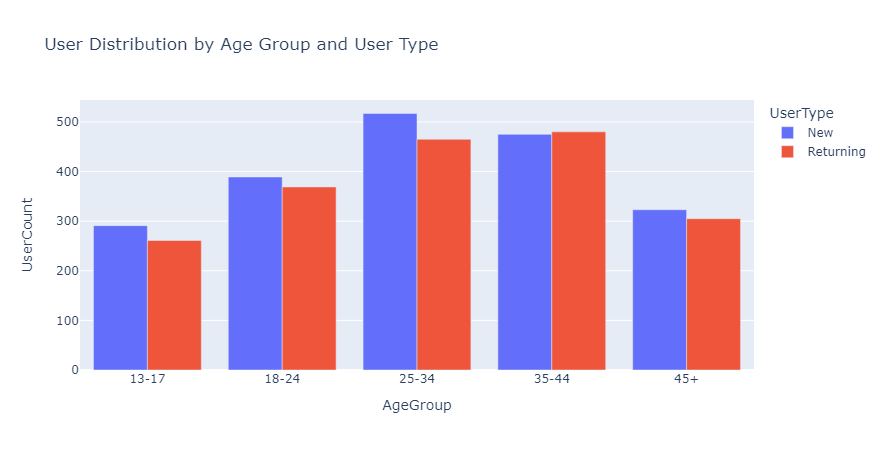

# 📌🚀 Webtoon User Engagement Analysis
---


## 📝 Table of Contents
1. [Project Overview](#project-overview)
2. [Key Metrics Analyzed](#Key-Metrics-Analyzed)
3. [Data Generation](#data-generation)
4. [User Engagement Metrics](#User-Engagement-Metrics)
5. [Visualizations](#visualizations)
6. [User Segmentation](#user-segmentation)
7. [Suggestions](#suggestions)
8. [Actionable Insights](#actionable-insights)
9. [Recommendations for Improvement](#Recommendations-for-Improvement)
10. [Conclusion](#Conclusion)
---

## 🚀 Project Overview
This project aims to analyze user engagement metrics for a webtoon platform. The goal is to understand how users interact with content, identify trends, and propose strategies to improve user engagement.
It generates synthetic data simulating user interactions and visualizes key performance indicators, including page views, average time spent, and bounce rates.  

---
### 📋 Key Metrics Analyzed:   

- **Page Views:** The total number of times users viewed the webtoon pages.
- **Average Time Spent:** The average duration users spent on the webtoon pages.
- **Bounce Rate:** The percentage of visitors who leave the site after viewing only one page.
- **User Demographics:** Insights into user age groups and types (new vs. returning users).

---
## 🚀 Data Generation
The dataset consists of user interaction data generated using Python, including fields such as:
- UserID
- SessionID
- DateTime
- WebtoonID
- PageViews
- AvgTimeSpent
- BounceRate
- DeviceType
- Location
- UserType
- AgeGroup

  ### 💻 Code Explanation
```python
# Function to generate random timestamps
def random_date(start, end):
    return start + timedelta(seconds=random.randint(0, int((end - start).total_seconds())))

# Generate User IDs and Session Data
user_data = {
    'UserID': [random.randint(1, num_users) for _ in range(num_sessions)],
    'SessionID': [f"S{random.randint(1000, 9999)}" for _ in range(num_sessions)],
    ...
}
df = pd.DataFrame(user_data)
df.head()
```

- **Purpose:** The code creates synthetic user data to simulate how users might interact with the webtoon platform.
- **Key Components:**
  - **Random Dates:** Generates random timestamps for user sessions.
  - **User IDs and Session Data:** Creates unique identifiers for users and their sessions to mimic real interactions.

### Output
- This data is saved in a CSV file, which serves as the dataset for our analysis.
---
### User Engagement Metrics
The following metrics were calculated to analyze user engagement:

1. **Page Views by Device Type**
2. **Average Time Spent vs. Bounce Rate**
3. **User Type Distribution**
---
## 📊 Visualizations
The analysis includes the following visualizations:
1. **Scatter Plot:** Displays the relationship between average time spent and bounce rate.
   
2. **Bar Chart:** Shows page views by device type.
   
3. **Bar Chart:** Illustrates the distribution of new vs. returning users.
   
---

### 👩‍💻 User Segmentation
1. **User Segmentation: Demographics and Behavior**

 The demographic and behavioral information from the dataset:
- **Age Group**: This is important for understanding what types of content are favored by different age segments.
- **User Type (New vs. Returning)**: This helps identify how loyal or engaged users are and which content encourages them to return.
  (few more)
- **Location**: Segment users based on their geographical location to understand regional preferences.
- **Device Type**: Segment users based on the device (Mobile, Desktop, Tablet) they are using to consume the content. This can provide insights into platform preferences and help optimize the user experience.

#### Example of User Segmentation:

| **Segment**         | **Metric**               | **Insights** |
|---------------------|--------------------------|--------------|
| Age Group (13-18)    | Avg Time Spent: 5 min     | Younger users spend less time, might prefer short-form content or visuals. |
| Age Group (19-29)    | Avg Time Spent: 12 min    | Older users spend more time, could be engaged with story-driven content. |
| New Visitors         | Bounce Rate: 60%         | High bounce rate, possibly due to unclear navigation or unengaging initial content. |
| Returning Visitors   | Bounce Rate: 30%         | Lower bounce rate, indicating better engagement. Might enjoy serialized content. |
| Mobile Users         | Page Views: 10,000       | Optimize for mobile-friendly designs and fast loading times. |
| Desktop Users        | Page Views: 5,000        | Can afford more detailed, high-resolution visuals or complex interactions. |

 2.📊 **Visualizing Segments**

To understand user behavior better, create visualizations for the different segments. Here are a few ideas:

` Bar Chart: User Distribution by Age Group and User Type`    

       


` Bar Chart: Returning vs. New Users`    

        

 


` Heatmap for Device Type usage by Age Group`    

 
 

 3.🧵 **Tailoring Content for Segments**

After analyzing the data, suggest content changes or strategies based on the insights from each segment:

 1. `Age Group (13-18)`
   - **Content Strategy**: Focus on visually appealing, short-form content like webtoon highlights, teasers, or character profiles.
   - **UI/UX**: Ensure a mobile-first experience with fast loading times, simple navigation, and engaging interactive elements (e.g., polls or quizzes).

 2. `Age Group (19-29)`
   - **Content Strategy**: Create deep, serialized content that dives into story arcs and character development. Introduce community-driven content, like discussions or fan theories.
   - **UI/UX**: Enable more customization options like saving favorite chapters or receiving recommendations based on previous reads.

 3. `New Visitors`
   - **Content Strategy**: Display featured or trending content to capture attention immediately. Use hooks in the first chapters to reduce bounce rates.
   - **UI/UX**: Optimize for user onboarding—introduce a clear call to action (CTA) like "Sign up to continue reading" or "Explore more."

 4. `Returning Visitors`
   - **Content Strategy**: Offer serialized content or exclusive early releases to keep them engaged. Personalized recommendations based on previously read content can increase loyalty.
   - **UI/UX**: Make it easy for them to pick up where they left off, possibly with notifications for new chapter releases.

 5. `Mobile Users`
   - **Content Strategy**: Prioritize mobile-friendly content, such as vertical scrolling webtoons. Mobile-exclusive content or early access for mobile users could increase engagement.
   - **UI/UX**: Ensure a seamless, lag-free experience on mobile devices. Implement touch-friendly navigation and fast-loading images.


---

**👉 Suggestions:**
- **Content Personalization:** Tailor content based on the age group. For example, younger audiences might prefer more colorful and dynamic content, while older users might prefer simpler layouts.
- **Retention Strategies:** Offer incentives for returning users, such as exclusive content or discounts.


---
## 💡 Actionable Insights
1. *Enhance Content Relevance*  (Tailor content based on user demographics and engagement patterns.)
2. *Improve User Retention*  (Implement strategies to increase average time spent on the platform, such as personalized recommendations.)
3. *Enhance User Engagement*
4. *Reduce Bouncing Rate*
---

## 📶 Recommendations for Improvement

Based on our analysis, here are some strategies to increase engagement:

1. **Enhance Content Quality:** Improve the visual and narrative quality of webtoons to keep users interested longer.
2. **Improve User Experience:** Optimize the website’s design for mobile devices, as many users access the site via smartphones.
3. **Targeted Marketing Campaigns:** Use the demographic data to launch targeted ads that resonate with specific age groups.
---

## 👉 Conclusion    

This analysis provides valuable insights into user behavior on the webtoon platform. By understanding these metrics, we can make informed decisions to enhance user engagement and improve the overall user experience.   

---
